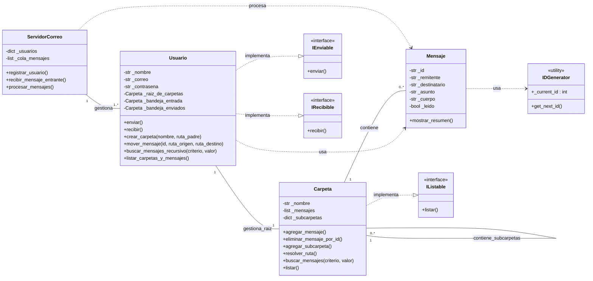
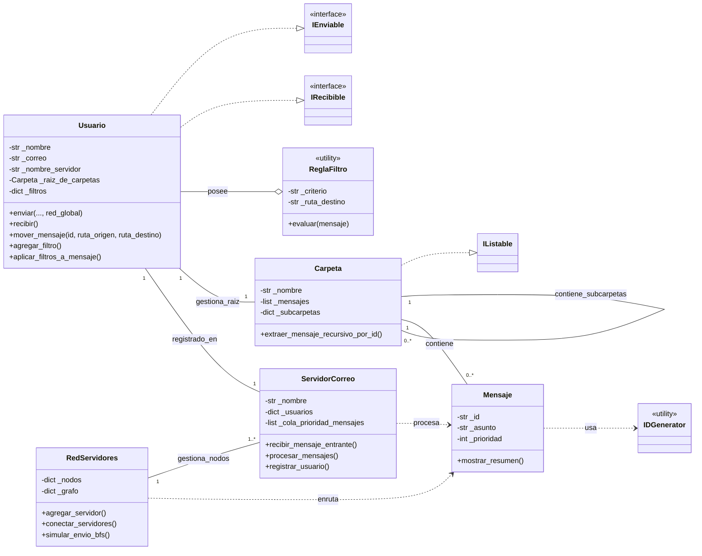

# 📧 Estructuras de Datos Entrega 2: Cliente de Correo en Python (Mail-Py - Grupo 33)

## Resumen del Proyecto

Este proyecto es una implementación básica de un cliente de correo electrónico, enfocado en el diseño orientado a objetos y en la aplicación de estructuras de datos recursivas (Árbol General) para la gestión de la jerarquía de carpetas.

> Consigna 1: _Sistema orientado a objetos que modele un cliente de correo electrónico, permitiendo la gestión de usuarios, mensajes, carpetas, filtros y operaciones típicas de un entorno de email._

> Consigna 2: _Implementar la gestión de carpetas y subcarpetas como una estructura recursiva (árbol general). Permitir mover mensajes entre carpetas y búsquedas recursivas de mensajes por asunto/remitente. Analizar la eficiencia de las operaciones implementadas._

> Consigna 3: _Implementar filtros automáticos usando listas y diccionarios para organizar mensajes según reglas  definidas por el usuario. Agregar una cola de prioridades para gestionar mensajes marcados como “urgentes”. Modelar la red de servidores de correo como un grafo (nodos: servidores, aristas: conexiones) y simular el envío de mensajes entre servidores usando BFS/DFS._

[PPT ENTREGA 1 - Documentación del proyecto](https://docs.google.com/presentation/d/1jEPt99lKJyqcMV4c-tW-b38CaCh5L7gn3pCMQ6u7BpQ/edit?usp=sharing)

[PPT ENTREGA 2 - Documentación del proyecto](https://docs.google.com/presentation/d/1-PlpkNlnq4GCbIMO-rbsvMb73dBxwL-JoUY6rJt93GQ/edit?usp=sharing)

[PPT ENTREGA 3 - Documentación del proyecto](https://docs.google.com/presentation/d/14PAV8i9i2H9BU35z8-ooJhw7bBGSYDASnwuUJR_DeqA/edit?usp=sharing)

## Integrantes

- Viviana Enriquez: vianquez5@gmail.com / vienriquez87@gmail.com (Github: DoomMetalLady)

- Rocío N. Rolón: rolon.rocio.natali@gmail.com (Github: rhiwen)

## Estructura de Carpetas

La siguiente estructura de archivos mantiene el código organizado y modular. Cada clase principal está en su propio archivo para respetar el principio de Responsabilidad Única.

```
.
├── src/
│ ├── __init__.py
│ ├── interfaces.py
│ ├── usuario.py
│ ├── mensaje.py
│ ├── carpeta.py
│ ├── servidor_correo.py
│ ├── red_servidores.py (nuevo entrega 3)
│ └── utilidades.py
├── main.py
└── README.md

````


- `src/`: Contiene todo el código fuente del proyecto.

- `src/interfaces.py`: Módulo para definir las interfaces (clases abstractas) del proyecto.

- `src/usuario.py`: Clase que modela al usuario del sistema.

- `src/mensaje.py`: Clase para representar los mensajes de correo.

- `src/carpeta.py`: Clase que gestiona los mensajes en las carpetas.

- `src/servidor_correo.py`: Clase que simula el servidor central.

- `src/utilidades.py`: Contiene el generador de IDs únicos para los mensajes.

- `main.py`: Archivo principal para la ejecución de la aplicación, donde se interactúa con las clases y se demuestra su uso.


## Instalación y Ejecución

Para levantar el proyecto localmente:

1. Clonar el repositorio:

```bash

git clone https://github.com/rhiwen/mail-py.git

cd mail-py

```

2. Ejecutar el programa principal:

```bash

python main.py

```


# ENTREGA 1

## 1. Clases Principales y su Responsabilidad

- **`Usuario`**: Responsable de la gestión del cliente de correo. Maneja la información del usuario (nombre, correo), y las operaciones de enviar y recibir mensajes, además de la gestión de carpetas. Implementa las interfaces **IEnviable** e **IRecibible**.

- **`Mensaje`**: Objeto de datos que encapsula toda la información de un correo (remitente, destinatario, asunto, cuerpo, etc.). Almacena esta información y ofrece métodos como por ejemplo, `mostrar_resumen()`.

- **`Carpeta`**: Contenedor para los objetos `Mensaje`. Agregar y lista los mensajes que le pertenecen. En esta primera entrega es una lista simple, pero su diseño permite que se convierta en una estructura de árbol en futuras entregas. Implementa la interfaz **IListable**.

- **`ServidorCorreo`**: Es el punto central para la lógica del sistema. Su responsabilidad principal es gestionar la creación de usuarios y procesar el flujo de mensajes entre ellos. Es un mediador entre los objetos `Usuario`.

## 2. Encapsulamiento y Propiedades

Se decidió encapsular los atributos de las clases (`_nombre`, `_correo`, `_mensajes`, etc.) para proteger la integridad de los datos. Se usan propiedades (`@property`) para permitir el acceso controlado a estos atributos, y en algunos casos, setters (`@nombre.setter`) para validar los cambios. Esto asegura que los datos se manejen de forma segura y consistente.

## 3. Uso de Interfaces (Módulo `abc`)

Las interfaces **IEnviable**, **IRecibible** e **IListable** se definieron usando el módulo `abc` de Python. Esto fuerza a las clases a implementar ciertos métodos, lo que hace el código más claro y mantenible. Por ejemplo, al exigir que la clase `Usuario` implemente `enviar()` y `recibir()`, se asegura que cualquier objeto `Usuario` pueda realizar esas operaciones, lo que simplifica el diseño a futuro.

## 4. Principio KISS

El diseño evita la complejidad innecesaria. Las clases son simples, con responsabilidades claras. Por ejemplo, el `ServidorCorreo` solo tiene los métodos que necesita para el flujo básico de mensajes. Las carpetas son simples listas de mensajes, así se puede comprender mas facilmente y tiene escalabilidad para las próximas entregas.


# ENTREGA 2

## 1. Implementación del Árbol General (Recursividad)

Para modelar la jerarquía de carpetas de manera fiel, decidimos implementar un **Árbol General**. La clave fue la clase `Carpeta`:

- **Nodo Recursivo**: Cada Carpeta ya no es solo una lista de mensajes, sino que ahora tiene un nuevo atributo, `_subcarpetas` (un diccionario), que guarda referencias a otras instancias de Carpeta. Este diseño recursivo permite anidar carpetas a cualquier profundidad.

- **Raíz en el Usuario**: Para mantener el principio de Responsabilidad Única (SRP), la clase `Usuario` contiene un único objeto **Carpeta** especial `(_raiz_de_carpetas)`. Las carpetas principales (`Entrada`, `Enviados`) son hijos directos de esta raíz. Esto simplifica las operaciones, ya que cualquier navegación o búsqueda siempre comienza desde esta raíz.

## 2. Decisiones de diseño

|Tema| Algunas opciones | Decisión | Justificación |
|--|--|--|--|
| Identificación de Mensajes | Usar Asunto/Remitente, usar UUID, usar ID secuencial. | **ID secuencial** de 4 cifras. | Usar solo el asunto o remitente era ambiguo. El UUID era demasiado para el tamaño del proyecto. Nos decidimos por un ID secuencial simple de 4 cifras que implementamos en `utilidades.py`. |
| Rutas de Carpetas | Rutas relativas o rutas absolutas. | **Rutas absolutas** con separador `/`. | Implementar rutas relativas (dependientes de la posición actual) es más complejo. Al usar rutas absolutas (ej.: `Entrada/Personal`), la función `resolver_ruta()` puede empezar siempre desde la **Raíz**, para hacer mas facil la navegacion y que no haya ambigüedades por ej cuando hay varias subcarpetas que comparten nombre en diferentes carpetas. _Acá tuvimos que hacer un balance entre cumplir con la consigna sin complicarnos demasiado ni dejar mucha ambigüedad, pero a la vez no hacernos odiar por el usuario._ |
| Movimiento de mensajes | Mover por nombre de carpeta o por ruta completa. | Usar **ID de mensaje** y **Rutas Completas**. | Para evitar mover un mensaje incorrecto o tener problemas con carpetas con nombres repetidos en distintas ramas del árbol, decidimos identificar el mensaje de forma única (con su ID) y ubicar las carpetas con su ruta completa. |
| Busqueda | Coincidencia exacta o parcial, _case-sensitive_ o _case-insensitive_. | **Búsqueda parcial** y **_case-insensitive_**. | Nos pareció más útil y amigable para el usuario, ya de por sí debe tipear las rutas completas de la carpeta, al menos no debe recordar de memoria tal cual los Asuntos o mails, si recuerda alguna palabra clave ya es suficiente (parcial) y todavía mejor no es necesario distinguir mayúsculas de minúsculas (case-insensitive). |

## 3. Análisis de eficiencia y complejidad

La operación más importante de esta entrega es la **Búsqueda Recursiva** de mensajes.

-   **Algoritmo Elegido:** **Búsqueda en Profundidad (DFS)**.

-   **Proceso:** El método `buscar_mensajes` de la clase `Carpeta` revisa primero sus propios mensajes y luego se llama a sí mismo en cada una de sus subcarpetas.

-   **Complejidad:** La eficiencia en el peor caso es **O(N+M)**.

-   N: Número total de carpetas (nodos del árbol).

-   M: Número total de mensajes en el sistema.

-   **Justificación:** El algoritmo es lineal con respecto al numero total de elementos a revisar, ya que cada carpeta y cada mensaje se visita y examina **una sola vez** durante el recorrido. Seria la mejor eficiencia para esta estructura de datos.

## 4. Diagrama de Clases (Entrega 2)




# ENTREGA 3

## 1. Implementación de Algoritmos Avanzados

En esta entrega aplicamos Grafos y un sistema de cola de prioridad (Urgencia) teniendo en cuenta el Principio de Responsabilidad Única (**SRP**) aislando el enrutamiento y revisando la recursividad como nos dijeron en la corrección por mail de la entrega 2.

### Estructuras de Datos Aplicadas

-   **Grafo No Dirigido (RedServidores)**: Se introdujo la clase `RedServidores` para modelar la infraestructura de correo como un **grafo no dirigido**. Cada nodo es un `ServidorCorreo` y cada arista es una conexión directa. Esto permite la simulación de enrutamiento entre servidores (cross-servidor).
    
-   **Cola de Prioridad (`ServidorCorreo`)**: La lista simple `_cola_mensajes` se reemplazó por una Cola de Prioridad basada en `heapq` (Min-Heap). Con esto ahora los mensajes marcados como **urgentes** (prioridad $-1$) son procesados antes que los mensajes normales (prioridad $0$).
    

### Corrección de la Entrega 2: Movimiento Recursivo

Revisamos la corrección que nos hicieron sobre la **función `mover_mensaje`**:

-   **Revisión:** Verificamos que el movimiento de un mensaje (`mover_mensaje`) **requiere buscarlo y extraerlo (eliminarlo)** de forma recursiva de la `ruta_origen` antes de agregarlo a la `ruta_destino`. Pero decidimos mejorarlo para que no queden dudas.
    
-   **Implementación:** Se creó el método `extraer_mensaje_recursivo_por_id` en la clase `Carpeta`. Este método realiza una búsqueda en profundidad (DFS) en el subárbol de la `ruta_origen` hasta encontrar el mensaje. Al encontrarlo, lo elimina de la lista de mensajes de la carpeta que lo contenía, asegurando que se extrae del lugar correcto. **La lógica de búsqueda recursiva se mantuvo correcta**.
    

## 2. Decisiones de Diseño y Principios SOLID (SRP/KISS)


| **Tema** 	| **Decisión Implementada** 	| **Justificación** 	|
|---	|---	|---	|
| A. Movimiento Recursivo (Corrección E2) 	| El método mover_mensaje busca y extrae recursivamente el mensaje a mover solo en el subárbol de la ruta_origen. 	| KISS/Eficiencia: Limita la búsqueda a la ruta especificada por el usuario. La extracción (eliminación) del mensaje es necesaria para simular el movimiento físico entre carpetas. 	|
| B. Modelado de Filtros 	| Se creó una clase simple ReglaFiltro (utility) que encapsula el criterio (asunto/remitente), el valor a buscar y la ruta_destino. 	| KISS: Diseño sencillo y declarativo suficiente para filtros básicos, evitando la complejidad innecesaria de patrones como Strategy. 	|
| C. Estructura de Prioridad 	| Implementación directa de la Cola de Prioridad en ServidorCorreo utilizando el módulo estándar heapq de Python. 	| KISS/Eficiencia: Se aprovecha una estructura de datos nativa altamente optimizada para la gestión de prioridades (Min-Heap), minimizando la abstracción. 	|
| D. Responsabilidad del Enrutamiento 	| Se creó la clase separada RedServidores para modelar el grafo, gestionar la topología y ejecutar los algoritmos de ruteo (BFS/DFS). 	| SRP (Responsabilidad Única): Aísla la complejidad de la lógica de red y grafo de la lógica central del servidor (ServidorCorreo), que solo debe gestionar usuarios y procesamiento de colas. 	|
| E. Algoritmo de Enrutamiento 	| Se utiliza Búsqueda en Amplitud (BFS) para el ruteo de mensajes en la red. 	| Técnica: BFS garantiza encontrar la ruta más corta (menor número de saltos) en un grafo no ponderado, siendo el método óptimo para el enrutamiento eficiente. 	|

## 3. Análisis de Eficiencia y Complejidad

Se implementaron algoritmos de complejidad conocida, optimizando el rendimiento:


| **Operación** 	| **Estructura de Datos** 	| **Algoritmo** 	| **Complejidad** 	|
|---	|---	|---	|---	|
| Movimiento Recursivo (Extracción) 	| Árbol General 	| DFS (Búsqueda en Profundidad) 	| $O(N+M)$ 	|
| Recepción/Prioridad de Mensaje 	| Cola de Prioridad (heapq) 	| Inserción (heappush) 	| $O(\log K)$ 	|
| Procesamiento de Mensajes 	| Cola de Prioridad (heapq) 	| Extracción (heappop) 	| $O(\log K)$ 	|
| Enrutamiento (Ruta Óptima) 	| Grafo No Dirigido 	| BFS (Búsqueda en Amplitud) 	| $O(V+E)$ 	|

-   **$V$**: Número de Servidores (Vértices).
    
-   **$E$**: Número de Conexiones (Aristas).
    
-   **$K$**: Número de Mensajes en la cola del servidor.
    
-   **$N$**: Número de Carpetas, **$M$**: Número de Mensajes (dentro del subárbol de búsqueda).
    

### Justificación de Eficiencia

-   **Ruteo BFS**: En el peor caso (grafo denso), BFS debe visitar todos los vértices ($V$) y todas las aristas ($E$) para encontrar la ruta más corta o confirmar que no existe. Su complejidad es lineal con respecto al tamaño del grafo.
    
-   **Prioridad**: El uso de un _Min-Heap_ (`heapq`) asegura que la inserción y extracción del mensaje de mayor prioridad sea logarítmica con respecto al número de mensajes en cola ($K$). Esto es altamente eficiente para un servidor que maneja un alto volumen de tráfico.
    

## 4. Casos de Borde Contemplados

Se diseñaron guardias para manejar situaciones inusuales o fallos en las operaciones clave:


| **Caso de Borde** 	| **Clase Afectada** 	| **Mecanismo de Control** 	|
|---	|---	|---	|
| Destino de Filtro Inexistente 	| Usuario (agregar_filtro) 	| El usuario valida con _resolver_ruta_carpeta si la ruta_destino del filtro existe antes de crear la regla. 	|
| Mensaje a Mover No Encontrado 	| Carpeta / Usuario (mover_mensaje) 	| extraer_mensaje_recursivo_por_id retorna None. Usuario.mover_mensaje muestra error si la extracción falla. 	|
| Servidor de Destino Inalcanzable 	| RedServidores (simular_envio_bfs) 	| BFS retorna None. Se informa al remitente que no existe ruta entre los servidores de origen y destino. 	|
| Destinatario No Registrado en la Red 	| RedServidores (obtener_servidor_destino) 	| Se itera sobre todos los servidores (self._nodos) para buscar el correo. Si falla, el ruteo se detiene y se informa el error. 	|
| Entrega Local (Mismo Servidor) 	| RedServidores (simular_envio_bfs/dfs) 	| Si servidor_origen == servidor_destino, se omite la búsqueda en el grafo y se entrega directamente. 	|

## 5. Diagrama de Clases (Actualizado Entrega 3)

El diagrama refleja la introducción de la `RedServidores` como nuevo coordinador de la arquitectura, la clase `ReglaFiltro` y el mapeo del `Usuario` a su servidor de registro.

